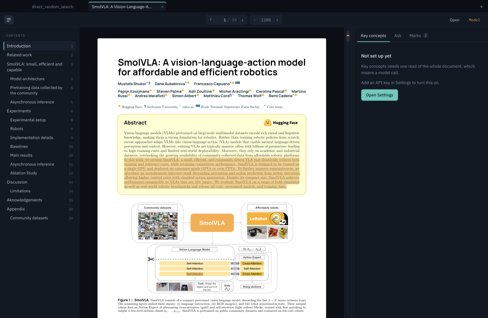
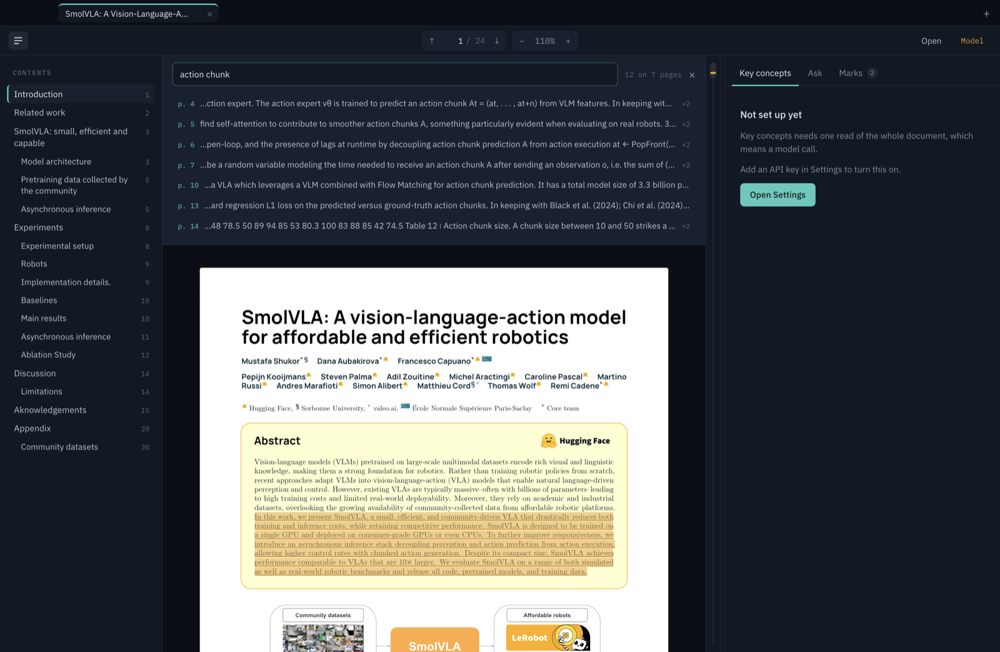

# Tiro

A PDF reader for macOS and Linux that keeps the whole document in context.

Open a paper, read it, select anything and ask. The model reads all of it once and
builds a concept map, so the term defined on page 4 is one click away when it
reappears on page 40 — instead of a scroll back through the parts you skimmed.


## What it does

**Read several papers at once.** Each open PDF is a tab, and each tab keeps its
own zoom, scroll position, concept map, marks, and conversation — switching back
puts you where you left off rather than resetting. An answer still arriving in a
background tab shows a live dot on that tab and lands there, not wherever you
happen to be looking.



The document's own table of contents is on the left. Your highlights sit on the
page in amber and as ticks in the thin ribbon between the page and the panel.

**The paper's own citations work.** Click `(Alayrac et al., 2022)` and the
bibliography entry comes to you in a small card — copyable, for pasting into a
search — with a button to the reference page if you want it. Jumping to the back
of a paper and finding your way home is the thing this avoids, so the entry
travels rather than you. Links to the web open in your browser.

**Read.** Continuous scroll, real text selection, the document's own table of
contents in the left rail, `⌘F` search across every page at once with jump-to
results. Drag the edge between the page and the panel to give either one more
room; double-click that edge to reset it. The `− A +` control at the end of the
tab row scales the panel's text, up to double, for anyone reading on a large
display — the panel keeps the width you dragged it to and only the contents
grow. Both are remembered.



Find searches the text pdf.js already extracted, so it costs nothing and covers
every page at once — matches come back grouped by page with the surrounding
sentence, and clicking one jumps there.

**Select and ask.** Select a passage and the bar offers four things:

- **Highlight** — your own mark, kept with the file
- **Define** — the term as *this document* uses it, citing where it says so
- **Explain** — the passage in plain language, naming what it depends on earlier
- **Ask…** — carries the selection into the Ask tab as context

The conversation is grouped into exchanges — your question with the answer to
it, separated by a rule and marked in amber, so you can find what you asked
rather than reading a wall of prose. A Define or Explain turn reads as the
action it was. Past a couple of exchanges a search box appears and filters them.

Every page citation in an answer (`[p. 12]`) is a button that jumps there, and
answers render LaTeX — `$\pi_\theta$` inline, `$$…$$` as a display equation —
so notation reads the way the paper writes it. Concept definitions render it too,
which matters most for the ones whose whole point is notation.

**Key concepts.** One pass over the whole document pulls out the terms, methods,
claims, notation, and recurring entities the argument rests on. The tab opens on
**On page N**, split into two groups:

- *Defined earlier* — used on this page, established before it. This is the list
  that means you never scroll back.
- *Introduced here* — new on this page.

Below that, the full map: searchable, filterable by kind, with every page a
concept appears on and a **Go deeper** answer per concept.

**Code.** Link the repository for a paper and Tiro finds where each concept is
actually implemented — file, line range, and one sentence on how the code
corresponds to the idea. Open any match and the file fills the window, with the
matched range marked and scrolled to; a sidebar is the wrong shape for reading
code. Escape closes it.

The repository is searched **on your machine**, not sent anywhere. `git ls-files`
gives the real source list, a regex pass extracts declarations, and concept terms
are matched against identifiers and comments locally — `action chunk` finds
`action_chunk`, `ActionChunk`, `chunk_size`. Only a shortlist of candidate
snippets goes to the model, which answers with candidate *ids* rather than paths,
so a hallucinated file is not merely unlikely but unrepresentable. Opening a full
file costs nothing at all.

**Ask about the code too.** Once a repository is linked, the Ask tab can search
and read it while answering — "is the chunk size in the paper the default here?",
"where does this loss actually get computed?". The answer shows what it looked
up before replying.

Any `path:line` it cites is a link that opens that file in the same full-width
reader, at that line.

This is not filesystem access. The model gets three read-only tools —
`search_code`, `read_file`, `list_files` — answered entirely from the in-memory
index of that one repository. Nothing outside it is reachable, nothing can be
written, and a path that is not an indexed source file is refused. Available on
Anthropic and OpenAI; local models do not get the tools, since support varies
too much by model to rely on.

That keeps a pass at roughly the cost of the concept extraction you already ran —
the paper is read from the same cache, so only the candidate code is new. It runs
on its own button, once per paper and repository, and is cached like the concept
map.

**The margin ribbon.** The thin strip between page and panel is a map of the
whole document: amber ticks are your highlights, teal ticks are where concepts
get established. Click any tick to jump.

Marks, concepts, and conversations are stored per file and restored when you
reopen it — so the whole-document read is paid for once.

## Getting started

Needs Node 22.12 or newer, and git. Nothing else — no Rust, no Docker, no
system libraries to install first.

```bash
git clone https://github.com/biirving/tiro.git && cd tiro && npm install && npm run dev
```

That is the whole thing: `npm install` pulls Electron, and the first run
regenerates the pdf.js assets automatically. To build installers instead of
running from source, see [Building installers](#building-installers).

Then open **Settings** (`⌘,` on macOS, `Ctrl+,` on Linux) and pick a model.

Reading a PDF, scrolling, highlighting, the outline, and find-in-document all
work with no model at all. Key concepts and Ask are the parts that need one.

## Choosing a model

Three backends, switchable at any time in Settings. The prompts are identical
across all three; only the transport differs.

| | What you need | Notes |
|---|---|---|
| **Anthropic** | An API key | Best whole-document reasoning. Explicit prompt caching, so re-asking is cheap. |
| **OpenAI** | An API key | Model list is fetched live from your account — no hardcoded IDs to go stale. |
| **Local** | [Ollama](https://ollama.com) running | Nothing leaves the machine. Weaker concept maps; mind the context window. |

Keys are encrypted with the OS keyring (`safeStorage`) and written to the app's
own support folder. They stay in the main process — the window never sees one —
and only leave in requests to that provider. `ANTHROPIC_API_KEY` and
`OPENAI_API_KEY` in the environment take priority over anything saved.

On Linux, `safeStorage` needs a keyring daemon (`gnome-keyring`, `kwallet`). With
none installed, Settings says so plainly and the key is written as a file
readable only by your user rather than encrypted.

### Running local models

Install Ollama, start it, and pull something with a real context window:

```bash
ollama serve
ollama pull qwen3:8b     # or whatever you prefer — Settings lists what you have
```

Tiro talks to Ollama's native API rather than its OpenAI-compatible endpoint,
for one specific reason: only the native API accepts `num_ctx`. Ollama otherwise
defaults to a few thousand tokens of context no matter what the model supports,
which would silently drop most of a paper — the one failure this app must not
have. Tiro sizes `num_ctx` to the document, reads the model's real window from
`/api/show`, and refuses with a clear message when the document genuinely does
not fit, rather than truncating it.

A 24-page paper is roughly 20k tokens, so a 4k or 8k model will refuse most
real documents. Pick something with 32k or more.

## Building installers

```bash
npm run dist:mac        # .dmg for arm64 + Intel
npm run dist:mac:arm    # Apple Silicon only, faster
npm run dist:linux      # .AppImage + .deb for x64
npm run dist:linux:arm  # same for arm64
```

Everything lands in `release/`. Both Linux targets cross-build from macOS —
electron-builder fetches the AppImage runtime and `fpm` itself, so no Docker and
no Linux box required.

### macOS

The build is **unsigned**, so it needs no Apple Developer account. Gatekeeper
will refuse it on first launch: right-click the app in Applications → **Open**,
then confirm. That is a one-time step per machine.

To ship it properly, put an Apple Developer certificate in your keychain, then
in `electron-builder.yml` remove `mac.identity: null` and add:

```yaml
mac:
  notarize: true
  entitlements: build/entitlements.mac.plist
  entitlementsInherit: build/entitlements.mac.plist
```

and export `APPLE_ID`, `APPLE_APP_SPECIFIC_PASSWORD`, and `APPLE_TEAM_ID` before
running `npm run dist:mac`.

### Linux

The `.AppImage` needs no install — mark it executable and run it:

```bash
chmod +x Tiro-0.1.0.AppImage
./Tiro-0.1.0.AppImage
```

Or install the `.deb` on Ubuntu or Debian, which also registers Tiro as a PDF
handler and puts it in the applications menu:

```bash
sudo apt install ./tiro_0.1.0_amd64.deb
```

Tested targets are Ubuntu 22.04 and later. On a bare container you may need the
usual Electron runtime libraries (`libgtk-3-0`, `libnss3`, `libasound2`); a
desktop install already has them.

## Cost, and how context is handled

The whole document goes into the prompt, last in the prefix, and every request
about a file reuses that prefix byte for byte. The first question pays for the
document; the rest should be much cheaper. Each backend needs something
different to make that actually happen:

One caveat worth knowing: tool definitions sit at the very front of the prompt,
so linking a repository gives the Ask tab its own cache entry, separate from the
one the concept and code passes share. It costs one extra write of the document
per session. The `[tiro]` log shows it.

**Anthropic** — an explicit `cache_control` breakpoint on the document block,
1-hour TTL. Every request about a document also pins the same `model`,
`thinking`, `betas`, and `effort`, because an `effort` change invalidates the
messages cache and, on some models, the system cache with it. That is why the
one-off concept read runs at the *same* effort as an ordinary answer rather than
a higher one: a different level would make the concept pass and the first
question each write the document to cache separately, at 1.25× apiece. On a
500k-token book that is several dollars per file to save a little thinking on a
one-word lookup.

**OpenAI** — prefix caching is automatic, but routing is not. Every request
carries `prompt_cache_key` derived from the document, so questions about the
same file land on the same cache instead of relying on luck.

**Ollama** — `num_ctx` is computed from the *document*, not from the current
prompt, and quantised to 8k steps. This is the subtle one: Ollama reloads its
context when `num_ctx` changes and throws away the KV cache with it. Sizing the
window to each prompt — which grows with every turn of conversation — would
silently re-evaluate the entire document on every single question. Deriving it
from the document keeps it constant, so the cache survives; `keep_alive` keeps
the model resident between questions.

### Watching what it costs

Caching is easy to believe and hard to notice, so every request logs its full
token accounting, an estimated cost, and a running session total:

```
[tiro] token legend — in: fresh (full rate) · cached (0.1x) · wrote (1.25x at 5m, 2x at 1h)
[tiro] concepts  claude-opus-5  in 21,504 (fresh 214 · cached 0 · wrote 21,290@1h)  out 3,812 (think 2,140)  41.2s  $0.3093  · session $0.3093 over 1 request
[tiro] ask       claude-opus-5  in 21,730 (fresh 440 · cached 21,290 · wrote 0)  out 268 (think 60)  3.1s  $0.0195  · session $0.3288 over 2 requests
```

That second line is the one to watch. The document arrived from cache, so the
question cost $0.0195 instead of the $0.1153 it would have cost cold — about 6×
cheaper, which is the whole design paying off. Thinking tokens are broken out
because they bill as output, at 5× the input rate on Opus.

If the prefix ever breaks, the line says so rather than leaving you to notice a
bill later:

```
[tiro] ask       claude-opus-5  in 21,730 (fresh 21,730 · cached 0 · wrote 0)  out 268  5.2s  $0.1153
       ↑ nothing cached and nothing written — the prefix is not being reused
```

Quitting prints a closing total. Failures log with their real error name and
stack, so a rejected key or a rate limit is identifiable rather than just a
message in the panel.

Prices come from Anthropic's published rates, cached in
`electron/providers/usage.ts`. For any other provider — and to correct a rate
that has moved — set `TIRO_PRICE_IN` and `TIRO_PRICE_OUT` in USD per million
tokens; without them the line reports tokens and says the cost is unpriced
rather than inventing a number. Local models report throughput and how much of
the prompt the KV cache reused, since they cost nothing to run.

Logging is on in development. Set `TIRO_USAGE_LOG=1` to get it from a packaged
build.

Nothing is ever silently truncated. A document past roughly 650k tokens is
refused outright, and on a local model, one past that model's own window is
refused with both numbers in the message.

### Long documents, and the optional index

A 686-page textbook is about 378k tokens. That still fits in context, but it
costs ~$0.19 a question against ~$0.01 for a paper, which is the real problem at
that scale — not capacity.

So Tiro can use [ferry](https://github.com/) as a search index when it is
installed: the model searches the document and reads the pages it needs instead
of carrying the whole thing. Ferry wraps the fluffy graph engine, whose
`search_hybrid` fuses dense HNSW and BM25 in one call, and whose entity
attributes carry the page number through retrieval — so citations keep working.

The half that lives in ferry is not written yet —
[docs/DOCUMENT_INDEX.md](docs/DOCUMENT_INDEX.md) is the contract, the reasoning,
and the numbers to verify against.

**It is entirely optional.** Tiro looks for a `ferry` executable on PATH (or a
path you set in Settings, or `TIRO_FERRY_COMMAND`). If there isn't one, the
probe fails in about 4ms, nothing is reported as broken, and every other feature
behaves exactly as it did before the index existed. The tools it contributes are
assembled per request, so with no ferry the model is sent no index tools at all.

**Indexing is a button, not a guess.** With ferry installed, the Ask tab offers
to index the open document and the Code tab offers to index the linked
repository. Nothing is indexed until you ask, and being indexed is what turns
the search tools on — there is no size threshold deciding for you. An unindexed
document sends no index tools at all and keeps the cache entry it already had.

Passages are cut per page at paragraph boundaries, so every one carries an exact
page number and can still be cited as `[p. 12]`. An over-long paragraph is split
on a sentence end rather than mid-thought. Code is cut by declaration instead —
a function with its body is the unit someone asks about — with the imports at the
top of a file as their own passage, and files with no declarations falling back
to fixed windows. Indexing this repository yields 1,176 passages, 95% of them
named for the declaration they cover.

One honest limitation: paragraph detection leans on blank lines, and a
two-column PDF extracts with few of them. On such a paper passages land near the
1,400-character cap and are cut on sentence boundaries rather than at true
paragraph breaks — clean, but coarser than ideal.

## Shortcuts

| | |
|---|---|
| `⌘O` / `Ctrl+O` | Open a PDF |
| `⌘T` | Open another PDF in a new tab |
| `⌘1`…`⌘9` | Jump to a tab by position |
| `⌘⇧]` / `⌘⇧[` | Next / previous tab |
| `⌘W` | Close tab |
| `⌘⇧W` | Close window |
| `⌘F` / `Ctrl+F` | Find in document |
| `⌘,` / `Ctrl+,` | Settings |
| `⌘+` / `⌘-` | Zoom |
| `⌘0` | Actual size |

Double-clicking a PDF opens it in Tiro once the app is installed — Finder on
macOS, or any file manager on Linux via the `.deb`. From a shell,
`open -a Tiro paper.pdf` on macOS and `tiro paper.pdf` on Linux both work, and
several paths at once open as several tabs.

## Layout

```
electron/          main process — window, menu, IPC
  providers/
    prompts.ts     the prompts and concept schema, shared by every backend
    anthropic.ts   Claude: cache breakpoints, adaptive thinking, structured output
    openai.ts      GPT: chat completions + json_schema response format
    ollama.ts      local: native API, so num_ctx can be sized to the document
    index.ts       registry, cancellation, error translation
    usage.ts       token accounting, pricing, and the [tiro] log lines
  index/
    mcp.ts         a small MCP stdio client (initialize, tools/list, tools/call)
    ferry.ts       finds ferry if it is installed; absence is a normal outcome
    chunks.ts      passages worth retrieving: paragraphs for prose, declarations for code
  tools/
    registry.ts    the tools one request gets — repo, index, or none
  repo/
    scan.ts        git ls-files, then a regex pass for declarations
    candidates.ts  concept terms to candidate code, locally and for free
    match.ts       shortlist to the model; ids back, never paths
    read.ts        one file out of a linked repo, refusing anything outside it
    tools.ts       the read-only tools the Ask tab gets over a linked repo
  docs.ts          document text, keyed by file path
  settings.ts      provider choice, model choice, encrypted keys
  preload.ts       the window's only bridge to the main process
shared/types.ts    vocabulary shared across the process boundary
renderer/src/
  App.tsx          state and coordination
  lib/pdf.ts       pdf.js: open, render, extract text, read the outline
  lib/selection.ts browser selection to storable, zoom-independent marks
  lib/layout.ts    page geometry for the scroll column and the ribbon
  lib/tabs.ts      one open document: its own view state, marks, and chat
  lib/text.ts      concept-to-page matching, LaTeX and citation parsing
  components/      viewer, panel tabs, ribbon, chrome
```

Regenerate the icon after editing `build/icon.svg`:

```bash
qlmanage -t -s 1024 -o /tmp build/icon.svg   # then sips + iconutil into build/icon.icns
```

## Notes

- `pdfjs-dist` character maps, standard fonts, colour profiles, and decoder wasm
  are copied into `renderer/public/pdfjs` by `npm run assets` (wired into `dev`
  and `build`), so CJK and scanned PDFs render with no network access.
- In production the window is served over a custom `app://` origin rather than
  `file://`, which keeps pdf.js's module worker and `fetch` behaving normally,
  and lets a real Content-Security-Policy apply.
